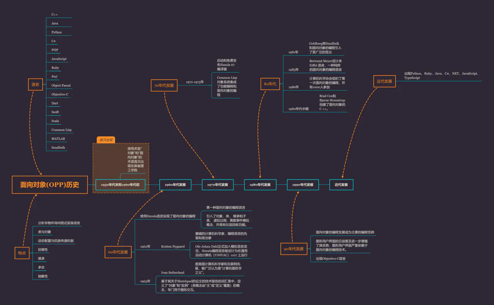

# 知识体系与工程体系

## [预习作业](WarmingUp.md)

## 把面向对象这个概念用追溯法写一篇博文



## 把课上老师的脑图里的这些实体补全
- [entity链接](entity.html)
- [Tag](tag.html)
- [JS知识](js.md)

Entity用法例子

1. Entity 转换库：[he](https://github.com/mathiasbynens/he)

2. Entity 使用场景：

   详细可以查看文章：[https://juejin.im/post/5e958768518825739b2d3e31](https://juejin.im/post/5e958768518825739b2d3e31)

   调用 PC 端支付宝支付，会返回如下表单：

```js
<form name="punchout_form" method="post" action="https://openapi.alipay.com/gateway.do?charset=utf-8&method=alipay.trade.page.pay&sign=XXX&return_url=https%3A%2F%2Fwww.xxx.com&notify_url=http%3A%2F%2Fxxx.com&version=1.0&app_id=2016021401143890&sign_type=RSA2&timestamp=2020-04-11+12%3A54%3A21&alipay_sdk=alipay-sdk-java-4.8.10.ALL&format=json">
<input type="hidden" name="biz_content" value="{&quot;out_trade_no&quot;:&quot;00000&quot;,&quot;product_code&quot;:&quot;FAST_INSTANT_TRADE_PAY&quot;,&quot;subject&quot;:&quot;充值&quot;,&quot;time_expire&quot;:&quot;2020-04-11 13:54:21&quot;,&quot;total_amount&quot;:&quot;999&quot;}">
<input type="submit" value="立即支付" style="display:none" >
</form>
<script>document.forms[0].submit();</script>
```

    如果需要截取其中参数，可以用he库进行转换，例如：

```js
he.decode('encoded string', {
  isAttributeValue: true,
});
```

转换结果如下：

```js
<form name="punchout_form" method="post" action="https://openapi.alipay.com/gateway.do?charset=utf-8&method=alipay.trade.page.pay&sign=XXX&return_url=https%3A%2F%2Fwww.xxx.com&notify_url=http%3A%2F%2Fxxx.com&version=1.0&app_id=2016021401143890&sign_type=RSA2&timestamp=2020-04-11+12%3A54%3A21&alipay_sdk=alipay-sdk-java-4.8.10.ALL&format=json">
<input type="hidden" name="biz_content" value="{"out_trade_no":"00000","product_code":"FAST_INSTANT_TRADE_PAY","subject":"充值","time_expire":"2020-04-11 13:54:21","total_amount":"999"}">
<input type="submit" value="立即支付" style="display:none" >
</form>
<script>document.forms[0].submit();</script>
```

    不过该场景很少出现，而且只需要在服务端处理，主要目的是将表单所带参数拼接成链接，并重定向到支付宝页面。
    不转换会导致支付宝无法正常解析参数，因此要把Entity转换成普通字符，如&quot;转换成"。
    前端可以直接将支付宝返回的表单写入HTML，浏览器会自动处理成正常格式。

# Q2:你能不能在 ECMA 中找到所有的类型（Type）
- 基础类型(7种)  String number null underfine object bool symbol 
- 语言类型7种
  - List 和 Record： 用于描述函数传参过程。
  - Set：主要用于解释字符集等。
  - Completion Record：用于描述异常、跳出等语句执行过程。
  - Reference：用于描述对象属性访问、delete 等。
  - Property Descriptor：用于描述对象的属性。
  - Lexical Environment 和 Environment Record：用于描述变量和作用域。
  - Data Block：用于描述二进制数据。 

# 作业3：把库里边的 URL 解析代码写一下
```js
   var parse_url = /^(?:([A-Za-z]+):)?(\/{0,3})([0-9.\-A-Za-z]+)(?::(\d+))?(?:\/([^?#]-))?(?:\?([^#]-))?(?:#(.-))?$/;

```

# 如果你要写一本关于整个前端开发的书，请你列出你的目录。

- 前端发展史
- 前端基础——HTML、CSS
- JavaScript
- 计算机网络 
- V8及其他浏览器内核 
- JavaScript常用设计模式 
- ES6、ES.Next发展
- 前端框架MVC与MVVM 
- 移动开发与混合开发 
- 小程序与跨端方案
- node初识 
- 前端工程化——工具链、自动化
- web安全及前端集成


# 如何在互联网上获取信息
```js

Array.prototype.map.call(document.querySelectorAll(".element"), e=>e.innerText);
Array.prototype.map.call($0.querySelectorAll('code'),e=>e.innerText).join('\n')

\\ 获取Css 属性

var iframe = document.createElement("iframe");

document.body.appendChild(iframe);

iframe.src = "https://www.w3.org/TR/2019/WD-css-lists-3-20190425/"

function happen(element, type){
  return new Promise(resolve => {
    element.addEventListener(type, resolve, {once: true})
  })
}

happen(iframe, "load").then(function(){
  Array.prototype.map.call(document.querySelectorAll("#container li[data-tag~=css] h2"), e=> e.children[0].href + " |\t" + e.children[0].textContent).join("\n")
  console.log(iframe.contentWindow);
})
async function start(){  
  for(let standard of  Array.prototype.slice.call(document.querySelectorAll("#container li[data-tag~=css] h2:not(.Retired):not(.GroupNote)"))) {
   console.log(standard.children[0].href);
   var output = []
    iframe.src = standard.children[0].href;
    await happen(iframe, "load");
    var properties = Array.prototype.map.call(iframe.contentWindow.document.querySelectorAll(".propdef [data-dfn-type=property]"), e => e.childNodes[0].textContent);
    if(properties.length){
        output.push(standard.children[0].textContent + " | " + properties.join(", "));
        console.log(output.join("\n"))
    };     
  }  
}
start();

```
### 4.6. 扩展学习
- ["编译系统透视：图解编译原理"](https://weread.qq.com/web/reader/9c632ee05ce2c79c6f5eaadkc81322c012c81e728d9d180)
- https://www.w3.org/
- http://w3school.com/
- [whatwg网站比较纯粹，知识体系的分类挺好](https://whatwg.org/)
- [谷歌学术搜索-很权威](https://scholar.google.com/)
- [MDN可以查资料但内容不是最新不够权威](https://developer.mozilla.org/)
- https://docs.microsoft.com/
- https://developer.apple.com/
- QCon：全球软件开发大会（ https://qcon.infoq.cn/2020/beijing/）
- Closure：闭包（ https://en.wikipedia.org/wiki/Closure_(computer_programming) ）
- https://www.ecma-international.org/


### 4.2. 参考链接：
- https://fed.taobao.org/blog/taofed/do71ct/fed-learning-quizzes-apply/?spm=taofed.blogs.blog-list.9.44fe5ac8p6qg66
- https://tools.ietf.org/html/rfc3986
- https://svn.apache.org/repos/asf/labs/webarch/trunk/uri/rev-2002/issues.html
- https://tools.ietf.org/
- https://github.com/spritejs/spritejs
- https://spritejs.org/#/
